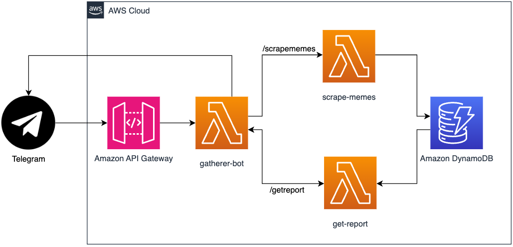

# RedditCrawler

The crawler for the most important resource in the world - memes

## How it works

This repository contains 3 AWS lambda functions, `lambda_function.py`, which handle the telegram bot logic, the meme scraping logic and the pdf creation logic respectively. This project relies on Amazon DynamoDB, AWS Lambda and Amazon API Gateway.

This diagram describes the architecture used in the serverless deployment. `gatherer-bot` contains the primary Telegram bot logic, and is webhooked to avoid long polling. Requests are routed through `gatherer-bot` to `scrape-memes` and `get-report` Lambda functions.

The bot uses two commmands: `/scrapememes` and `/getreport`.

`/scrapememes` is routed to `scrape-memes` Lambda and gets the top 20 posts from r/memes of the day, and stores them in a DynamoDB database.

`/getreport` is routed to `get-report` Lambda and retrieves the 20 posts from the database and generates a pdf, which is then sent to the user.

`packager.sh` packages the code for simplicity. This can be enhanced to use containers on AWS.

## Getting Started

First, try messaging @TheMemeGathererBot on Telegram!

Since this project is so specific, I won't go into detail on how to create your own identical bot. Instead, I will detail the broad steps, which you can also emulate if you wish to create a similar bot! Here are steps to set up your own bot:

1. Create a [Reddit application](https://www.reddit.com/prefs/apps)

2. Create a Telegram bot with the [BotFather](https://telegram.me/BotFather)

3. Create an Amazon API Gateway and AWS Lambda functions. The API Gateway should route requests to your Lambda functions

4. Host bot and any logic on AWS Lambda

5. Set up a webhook from Telegram for your bot

